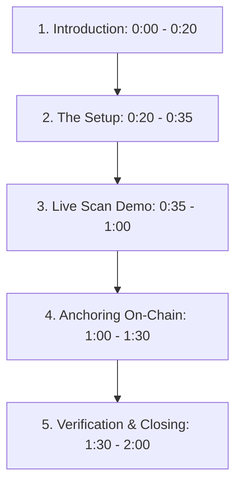

# ShadowRepo Shield — LinkedIn Demo Video Script

Use this structured script to record a high-impact, 2-minute demo video showing off **ShadowRepo Shield** for your LinkedIn audience.

---

## Video Outline & Flow

---

## 1. Introduction (0:00 - 0:20)
**Visual:** Webcam video of you speaking, transitioning to show the ShadowRepo Shield desktop application dashboard on your screen.
- *Voiceover:*
  > "Web3 developers, how do you verify dependencies or open-source repositories before running them locally, without risking your private IP by uploading it to cloud scanners?
  > Meet **ShadowRepo Shield**—a local-first blockchain security scanner.
  > The rule is simple: **Your code stays on your device. Only the cryptographic proof goes on-chain.**"

---

## 2. The Setup (0:20 - 0:35)
**Visual:** Show a split screen. On the left is the Tauri desktop application, on the right is a command terminal running the local Hardhat blockchain network.
- *Voiceover:*
  > "Here, I have the app running locally on Windows as a native desktop application, and I've started a local Hardhat Ethereum node to simulate on-chain transaction submissions for this demo."

---

## 3. Live Scan Demo (0:35 - 1:00)
**Visual:** Navigate to the **New Scan** page in the app, drag and drop `malicious.zip` (the mock repository), and click **Start Security Scan**. Show the scanning animation and the transition to the results page.
- *Voiceover:*
  > "Let's perform a live scan on a mock suspicious repository ZIP. This repo contains hidden install hooks, env file accessors, and wallet-drainer signatures.
  > I start the scan... it walks the directory tree instantly, and... there we go. We have a **Critical Risk Score of 100**."

---

## 4. Analyzing Findings & Anchoring On-Chain (1:00 - 1:30)
**Visual:** Scroll through the findings list, pointing out the detected postinstall script, process execs, and `setApprovalForAll` wallet-drainer signatures. Then, click **Anchor Proof** and highlight the appearing transaction hash.
- *Voiceover:*
  > "The scanner flagged a postinstall hook executing shell scripts, code accessing `.env` secrets, and high-risk token approvals.
  > Instead of uploading this report to a cloud server, we can verify this scan state publicly. I click **Anchor Proof**, sending the cryptographic hashes to our smart contract. The proof is officially anchored on-chain with transaction hash `0x781d...`."

---

## 5. Verification & Closing (1:30 - 2:00)
**Visual:** Copy the report hash. Go to the **Verify Proof** page, paste it into the search input, and click **Verify On-Chain**. The verified details card appears.
- *Voiceover:*
  > "To verify it, I can copy the report hash, head to the **Verify Proof** page, and query the contract directly. It instantly pulls the validated repository hash, risk score, and scanner signature straight from the blockchain ledger.
  > ShadowRepo Shield keeps Web3 developers safe without telemetry or cloud exposure. Check out the setup guide in the repo to run this demo yourself!"
